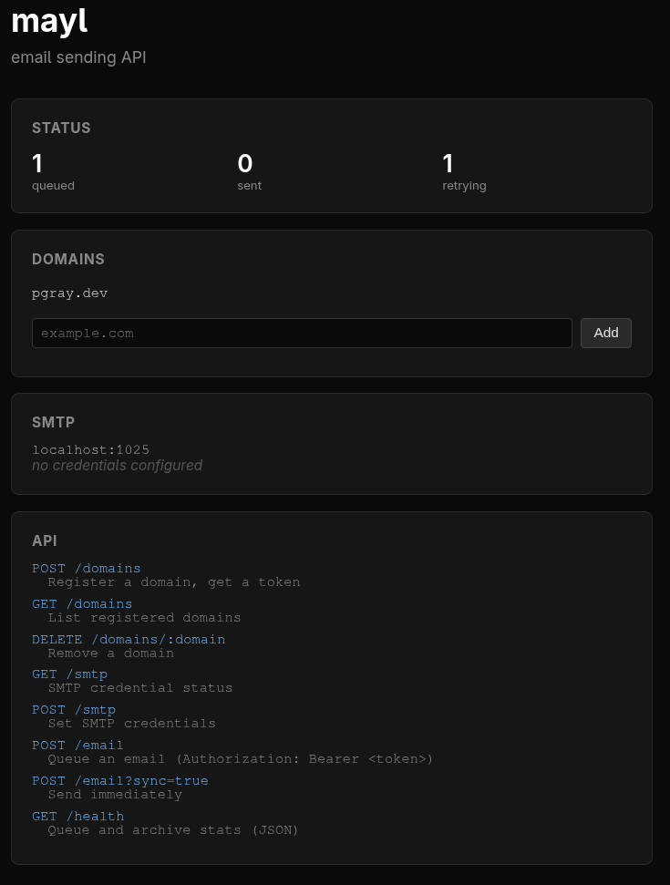

# mayl



A self-hosted email-sending API backed by Protonmail Bridge, running in a single Docker container.

Emails are submitted over a simple HTTP API and delivered via SMTP through
[protonmail-bridge](https://proton.me/mail/bridge). A SQLite-backed queue
handles retries and an archive keeps a record of sent messages. Domain-based
token authentication controls who can send.

## Architecture

```
         ┌──────────────────────────────────────┐
         │           Docker container            │
         │                                       │
         │  ┌─────────────────────────────────┐  │
         │  │  protonmail-bridge               │  │
         │  │  localhost:1025 (SMTP)            │  │
         │  │  Xvfb + Fluxbox + noVNC :6080    │  │
         │  └──────────────┬──────────────────┘  │
         │                 │ SMTP                 │
         │  ┌──────────────▼──────────────────┐  │
         │  │  mayl (Rust)                     │  │
         │  │  :8080 HTTP API                  │  │
         │  │  SQLite queue + archive          │  │
         │  └─────────────────────────────────┘  │
         │                                       │
         │  runit (PID 1) supervises all services │
         └──────────────────────────────────────┘
              :8080              :6080
            HTTP API        VNC (browser)
```

A single container runs both **protonmail-bridge** and the **mayl** API.
Bridge provides SMTP on localhost:1025; mayl connects to it directly. noVNC
on port 6080 lets you log in to your Proton account through a browser.
[runit](https://smarden.org/runit/) supervises all processes, handling signal
forwarding, automatic restarts, and clean shutdown.

## Quickstart

### 1. Start the container

```bash
docker compose up -d --build
```

### 2. Log in to Protonmail Bridge via VNC

Open [http://localhost:6080](http://localhost:6080) in your browser. You will
see a desktop with the Protonmail Bridge GUI. Sign in with your Proton account
credentials and note the SMTP username and password that Bridge generates.

### 3. Configure SMTP credentials

Pass the bridge-generated credentials to mayl via the API:

```bash
curl -s -X POST http://localhost:8080/smtp \
  -H 'Content-Type: application/json' \
  -d '{"user": "your-bridge-username", "pass": "your-bridge-password"}'
```

Credentials are persisted in SQLite and survive container restarts. You can
also set them as environment variables (`MAYL_SMTP_USER`, `MAYL_SMTP_PASS`)
but API-configured values take precedence.

Verify the credentials are set:

```bash
curl -s http://localhost:8080/smtp
```

### 4. Register a domain

```bash
curl -s -X POST http://localhost:8080/domains \
  -H 'Content-Type: application/json' \
  -d '{"domain": "yourdomain.com"}'
```

Response:

```json
{"domain": "yourdomain.com", "token": "xxxxxxxx-xxxx-xxxx-xxxx-xxxxxxxxxxxx"}
```

Save the token -- you'll use it as a Bearer token to send emails.

### 5. Send an email

Queue an email (async, returns `202 Accepted`):

```bash
curl -s -X POST http://localhost:8080/email \
  -H 'Content-Type: application/json' \
  -H 'Authorization: Bearer YOUR_TOKEN' \
  -d '{
    "from": "you@yourdomain.com",
    "to": ["recipient@example.com"],
    "subject": "Hello from mayl",
    "body": "Plain text body.",
    "html": "<h1>Hello</h1><p>HTML body.</p>"
  }'
```

Send immediately (sync, returns `200 OK`):

```bash
curl -s -X POST 'http://localhost:8080/email?sync=true' \
  -H 'Content-Type: application/json' \
  -H 'Authorization: Bearer YOUR_TOKEN' \
  -d '{
    "from": "you@yourdomain.com",
    "to": ["recipient@example.com"],
    "subject": "Sent immediately",
    "body": "This was sent synchronously."
  }'
```

## API Reference

### `GET /`

Web dashboard showing queue/archive stats, registered domains, SMTP info,
and an inline domain creator form.

### `POST /domains`

Register a domain and receive an API token.

**Request body:** `{"domain": "example.com"}`

**Response (`201`):** `{"domain": "example.com", "token": "..."}`

### `GET /domains`

List all registered domains.

**Response (`200`):** `[{"domain": "example.com", "created_at": 1234567890}]`

### `DELETE /domains/{domain}`

Remove a registered domain and its token.

**Response:** `204 No Content` or `404 Not Found`

### `GET /smtp`

Returns whether SMTP credentials are configured (password is not exposed).

**Response (`200`):**

```json
{"configured": true, "user": "bridge-user@proton.me"}
```

### `POST /smtp`

Set or update SMTP credentials. Persisted to SQLite and applied immediately.

**Request body:** `{"user": "...", "pass": "..."}`

**Response (`200`):** `{"status": "ok"}`

### `POST /email`

Send or queue an email. Requires `Authorization: Bearer <token>` header.
The token must match the domain in the `from` address.

**Query parameters:**

| Parameter | Type | Default | Description |
|-----------|------|---------|-------------|
| `sync`    | bool | `false` | `true` = send immediately; `false` = queue |
| `save`    | bool | `true`  | `false` = skip archiving (only with `sync=true`) |

**Request body (JSON):**

| Field     | Type       | Required | Description |
|-----------|------------|----------|-------------|
| `from`    | string     | yes      | Sender (e.g. `"Ada <ada@example.com>"`) |
| `to`      | string[]   | yes      | Recipient addresses |
| `subject` | string     | yes      | Subject line |
| `body`    | string     | yes      | Plain-text body |
| `html`    | string     | no       | HTML body (sends multipart/alternative) |

**Responses:**

| Status | Meaning | Body |
|--------|---------|------|
| `200`  | Sent (sync) | `{"id": "...", "status": "sent"}` |
| `202`  | Queued | `{"id": "...", "status": "queued"}` |
| `400`  | Validation error | `{"error": "..."}` |
| `401`  | Missing/invalid token | `{"error": "..."}` |
| `403`  | Domain mismatch | `{"error": "..."}` |
| `502`  | SMTP error (sync) | `{"error": "smtp error: ..."}` |

### `GET /health`

Returns queue and archive statistics.

**Response (`200`):**

```json
{"status": "ok", "queue_size": 0, "archive_size": 1234}
```

## Configuration

All configuration is via environment variables. No config file.

| Variable | Default | Description |
|----------|---------|-------------|
| `MAYL_SMTP_HOST` | `localhost` | SMTP server hostname |
| `MAYL_SMTP_PORT` | `1025` | SMTP server port |
| `MAYL_SMTP_USER` | (empty) | SMTP username (from Bridge); overridden by `POST /smtp` |
| `MAYL_SMTP_PASS` | (empty) | SMTP password (from Bridge); overridden by `POST /smtp` |
| `MAYL_SERVER_HOST` | `0.0.0.0` | HTTP bind address |
| `MAYL_SERVER_PORT` | `8080` | HTTP bind port |
| `MAYL_QUEUE_POLL_SECONDS` | `5` | Seconds between queue polls |
| `MAYL_ARCHIVE_MAX_ROWS` | `100000` | Max rows in archive before culling |
| `MAYL_ARCHIVE_CULL_INTERVAL_SECONDS` | `600` | Seconds between archive trims |
| `MAYL_DB_PATH` | `mayl.db` | SQLite database path |
| `MAYL_DOMAINS` | (empty) | Comma-separated domains to seed on startup |

## Process Supervision

All processes are managed by [runit](https://smarden.org/runit/) (PID 1).
Each service has a `run` script in `sv/` that gets symlinked to `/etc/service/`.
runit automatically restarts any service that exits.

| Service      | Description |
|--------------|-------------|
| `xvfb`       | Virtual X display (:99) |
| `fluxbox`    | Window manager |
| `stalonetray`| System tray (for bridge icon) |
| `x11vnc`     | VNC server on :5900 |
| `websockify` | WebSocket proxy (noVNC on :6080) |
| `bridge`     | protonmail-bridge with GUI |
| `mayl`       | mayl HTTP API |

The entrypoint script runs one-time init (GPG key, pass, D-Bus) then
`exec runsvdir /etc/service` to hand off to runit.

## Ports

| Port   | Service          |
|--------|------------------|
| `8080` | mayl HTTP API    |
| `6080` | noVNC (browser)  |

## Volumes

| Volume          | Mount point                     | Purpose |
|-----------------|---------------------------------|---------|
| `bridge-config` | `/root/.config/protonmail`      | Bridge config |
| `bridge-data`   | `/root/.local/share/protonmail` | Bridge data |
| `bridge-gnupg`  | `/root/.gnupg`                  | GPG keys |
| `bridge-pass`   | `/root/.password-store`         | Credentials |
| `mayl-data`     | `/data`                         | SQLite database |
