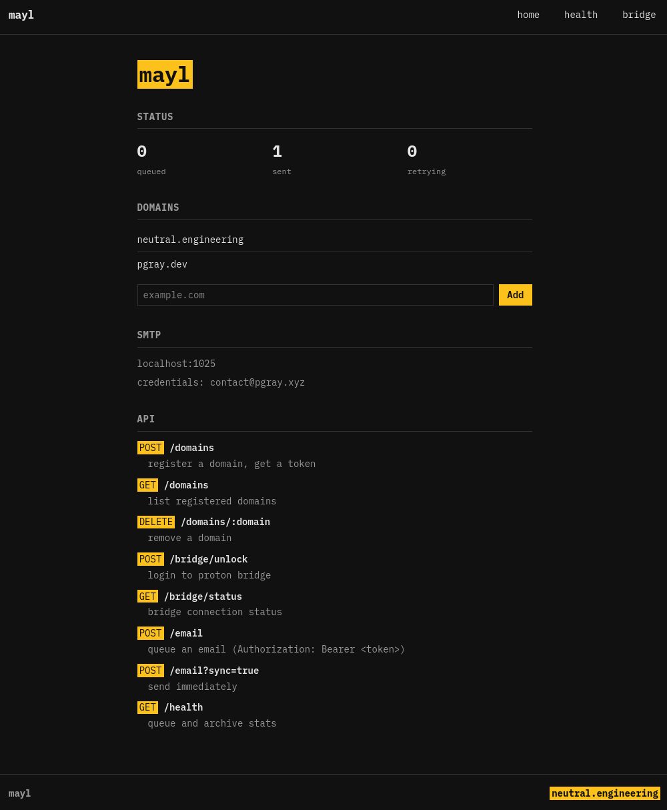

# mayl



Email-sending HTTP API backed by Protonmail Bridge in a single Docker container.

Bridge runs in gRPC mode; mayl connects to it over a Unix socket, handles login via the API, and auto-harvests SMTP credentials. A SQLite queue handles retries and an archive keeps sent messages. Domain-based token auth controls who can send.

## Quickstart

```bash
docker compose up -d --build
```

Log in to your Proton account:

```bash
./tools/unlock
```

Register a domain and send a test email:

```bash
./tools/add-domain yourdomain.com
./tools/send
```

Or use the web dashboard at http://localhost:8080.

## API

| Method | Path | Description |
|--------|------|-------------|
| `GET` | `/` | Web dashboard |
| `GET` | `/health` | Queue and archive stats (JSON) |
| `GET` | `/health.html` | Health page |
| `GET` | `/bridge.html` | Bridge status page |
| `POST` | `/bridge/unlock` | Login to Proton bridge |
| `GET` | `/bridge/status` | Bridge connection status (JSON) |
| `POST` | `/domains` | Register a domain, get a token |
| `GET` | `/domains` | List domains |
| `DELETE` | `/domains/{domain}` | Remove a domain |
| `POST` | `/email` | Queue an email (`Authorization: Bearer <token>`) |
| `POST` | `/email?sync=true` | Send immediately |
| `GET` | `/smtp` | SMTP credential status |
| `POST` | `/smtp` | Set SMTP credentials |

### Sending email

```bash
curl -X POST http://localhost:8080/email?sync=true \
  -H 'Authorization: Bearer YOUR_TOKEN' \
  -H 'Content-Type: application/json' \
  -d '{
    "from": "you@yourdomain.com",
    "to": ["recipient@example.com"],
    "subject": "Hello from mayl",
    "body": "Plain text body.",
    "html": "<h1>Hello</h1>"
  }'
```

### Bridge unlock

All credentials via headers:

```bash
curl -X POST http://localhost:8080/bridge/unlock \
  -H 'BRIDGE-USERNAME: user@proton.me' \
  -H 'BRIDGE-LOGIN-PW: password' \
  -H 'BRIDGE-UNLOCK-PW: mailbox-password' \
  -H 'BRIDGE-TOTP: 123456'
```

## Configuration

All via environment variables.

| Variable | Default | Description |
|----------|---------|-------------|
| `MAYL_SMTP_HOST` | `localhost` | SMTP host |
| `MAYL_SMTP_PORT` | `1025` | SMTP port |
| `MAYL_SERVER_HOST` | `0.0.0.0` | HTTP bind address |
| `MAYL_SERVER_PORT` | `8080` | HTTP bind port |
| `MAYL_BRIDGE_CONFIG_DIR` | (empty) | Bridge gRPC config dir (enables bridge integration) |
| `MAYL_DB_PATH` | `mayl.db` | SQLite path |
| `MAYL_DOMAINS` | (empty) | Comma-separated seed domains |
| `MAYL_QUEUE_POLL_SECONDS` | `5` | Queue poll interval |
| `MAYL_ARCHIVE_MAX_ROWS` | `100000` | Max archive rows |
| `MAYL_ARCHIVE_CULL_INTERVAL_SECONDS` | `600` | Archive cull interval |

## Tools

Shell helpers in `tools/`:

| Script | Description |
|--------|-------------|
| `unlock` | Interactive Proton bridge login |
| `status` | Bridge + SMTP status |
| `add-domain <domain>` | Register a sending domain |
| `domains` | List domains |
| `send` | Send an email interactively |
| `health` | Queue/archive stats |
